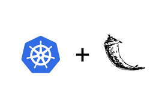
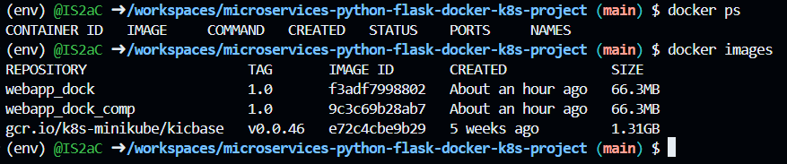

# microservices-python-flask-docker-k8s-project

Iniatiation deploying applications to cluster kubernetes approach....
During this formation, we was able to :
- deploying flask applicaton using docker
- deploying flask applicaton using docker compose
- deploying flask applicaton using docker minikube(local version of k8s)

### Steps of this project 
- Installing Python 3.X
- Creating Python Virtual Environments
- Installing Python VS Code Extension
- Sample Flask Application
- Jinja templating for Dynamic Web Pages
- Using Pip to Freeze Python Dependencies
- Building the docker image using Dockerfile
- Writing Docker Compose file
- Writing Kubernetes Manifest files for the application
- Creating Helm Chart

It was a very fun initiation to application deploying on kubernetes ....